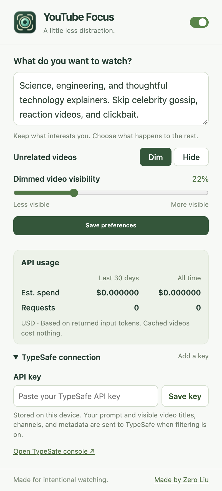

<h1 align="center">YouTube Focus</h1>

Describe what you want to watch, and YouTube Focus dims or hides videos outside your interests on the YouTube homepage and in watch-page recommendations. This Chrome extension uses [TypeSafe AI](https://typesafe.ai)'s Jev model to match recommendations to your preferences.

<p align="center">
  
</p>

## How to set up

Copy this prompt into your coding agent to get help with setup:

```text
Help me set up YouTube Focus from https://github.com/zeroliu/youtube-focus.
Read the README, check that Git and Node.js 20.12 or newer are installed,
and clone the repo if I don't already have it. Install dependencies with
npm ci and build the extension with npm run build.

Then walk me through loading the dist folder as an unpacked extension in
Chrome 120 or newer and pinning YouTube Focus. Help me get a TypeSafe API
key and enter it directly in the extension's TypeSafe connection settings.
Ask what I want to watch, help me write my interests, and explain the Dim
and Hide options. Finish by helping me check that filtering works on YouTube.
```

Or follow the steps below yourself.

### Install

You'll need Git, [Node.js](https://nodejs.org/) 20.12 or newer, and Chrome 120 or newer.

```sh
git clone https://github.com/zeroliu/youtube-filter.git
cd youtube-filter
npm ci
npm run build
```

1. Open `chrome://extensions` in Chrome.
2. Turn on **Developer mode** in the top-right corner.
3. Click **Load unpacked** and select the project's `dist` folder.
4. Open Chrome's extensions menu and pin **YouTube Focus** for easy access.

### Get your TypeSafe token

The extension needs your own TypeSafe API key, also called an API token.

1. Go to the [TypeSafe console](https://console.typesafe.ai) and sign in or create an account. If you don't yet have access, join the waitlist at [typesafe.ai](https://typesafe.ai).
2. Get an API key from your console dashboard, as described in the [official quick start](https://docs.typesafe.ai/introduction/quickstart).
3. Click the **YouTube Focus** extension icon and expand **TypeSafe connection**.
4. Paste the token into **API key**, then click **Save key**.

Your key is stored locally in your Chrome profile. API requests use your TypeSafe account; see [TypeSafe's model pricing](https://docs.typesafe.ai/models) for current rates.

## Use

1. Open the extension and describe your interests under **What do you want to watch?** For example:

   > Science, engineering, and thoughtful technology explainers. Skip celebrity gossip, reaction videos, and clickbait.

2. Choose what happens to unrelated videos:
   - **Dim** fades them while keeping them clickable. Adjust **Dimmed video visibility** to set how faint they appear.
   - **Hide** removes them from the feed layout.
3. Click **Save preferences**, then open or reload the [YouTube homepage](https://www.youtube.com/) or a video watch page. Videos are checked as you scroll, and future preference changes update the feed automatically.

Use the switch at the top to pause filtering and show every video again. **API usage** shows request counts and estimated spending for the last 30 days and all time, for this extension in this Chrome profile. Cached results don't add API requests.

Filtering applies to regular videos on the desktop homepage and in the recommended area beside or below a playing video. The player, search results, subscriptions, and Shorts shelves are left alone. Videos start dimmed or hidden while they're checked; if an API request fails, unchecked videos become visible again.

## What gets sent to TypeSafe?

Your interests prompt and each video's ID, title, channel, and visible metadata are sent to TypeSafe for evaluation. The extension does not send cookies, account details, watch history, transcripts, or thumbnail images.

## Development

```sh
npm run check
npm test
npx playwright install chromium
npm run test:e2e
```

Browser tests run the unpacked extension with a test YouTube page and simulated API responses. After changing the code, run `npm run build`, reload the extension at `chrome://extensions`, and reload YouTube.

For a personal build with a preconfigured key, set `TYPESAFE_API_KEY` in a local `.env` file and run `npm run build:local`. This embeds the key in `dist/local-config.json`, so keep that build private. Both `.env` and `dist/` are ignored by Git.
